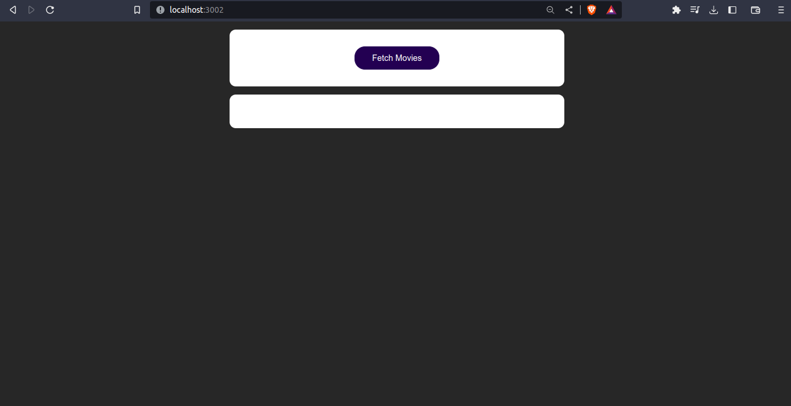
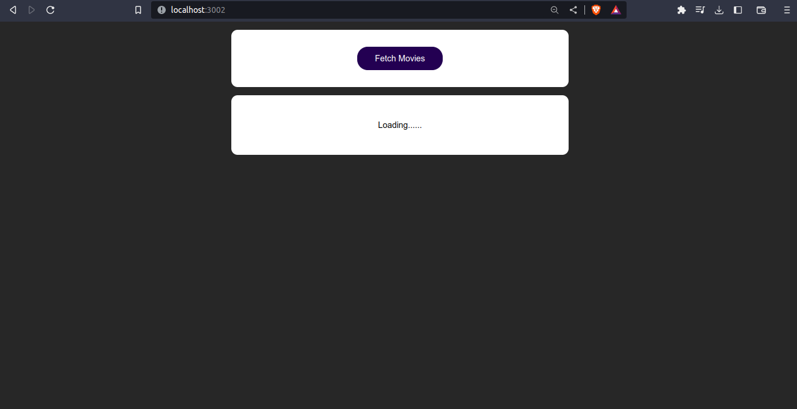
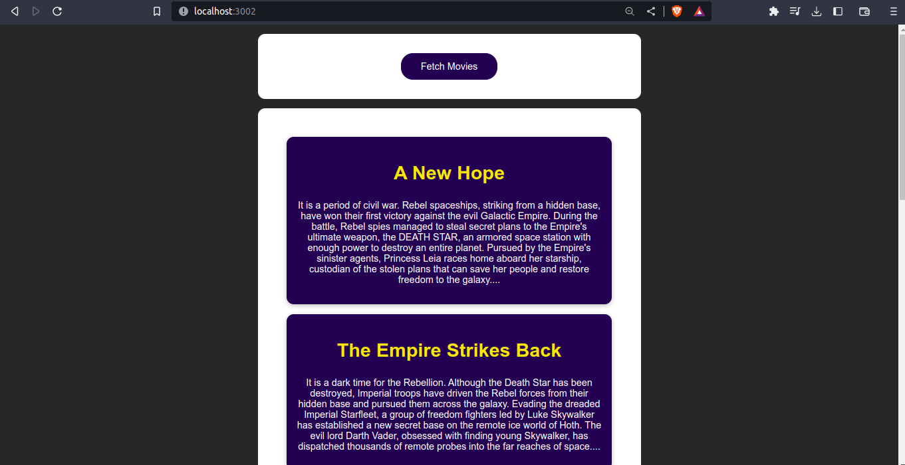

<div align="center" id="top"> 
  

  &#xa0;

  <!-- <a href="https://reactthecompleteguide.netlify.app">Demo</a> -->
</div>

<h1 align="center">React(Rest API)</h1>

<p align="center">
  

  

  

  <!--  -->

  <!--  -->

  

  
</p>

<!-- Status -->

<h4 align="center"> 
	🚧  React The Complete Guide 🚀 Under construction...  🚧
</h4> 

<hr>

<p align="center">
  <a href="#dart-about">About</a> &#xa0; | &#xa0; 
  <a href="#sparkles-features">Features</a> &#xa0; | &#xa0;
  <a href="#rocket-technologies">Technologies</a> &#xa0; | &#xa0;
  <a href="#white_check_mark-requirements">Requirements</a> &#xa0; | &#xa0;
  <a href="#checkered_flag-starting">Starting</a> &#xa0; | &#xa0;
  <a href="#memo-license">License</a> &#xa0; | &#xa0;
  <a href="https://github.com/Tphilus" target="_blank">Author</a>
</p>

<br>

## :dart: About ##

<!-- Describe your project -->
How to fetch movies using Rest API <br>
Sending Http Request (eg. Connecting to the database)


## :sparkles: Features ##

:heavy_check_mark: UseState;\
:heavy_check_mark: Fetch(Rest API);\
:heavy_check_mark: UseEffect;\
:heavy_check_mark: Sending a POST Request;\
:heavy_check_mark: Sending a GET Request;

## :rocket: Technologies ##

The following tools were used in this project:

<!-- - [Expo](https://expo.io/) -->
- [Node.js](https://nodejs.org/en/)
- [React](https://pt-br.reactjs.org/)
<!-- - [React Native](https://reactnative.dev/) -->
<!-- - [TypeScript](https://www.typescriptlang.org/) -->

## :white_check_mark: Requirements ##

Before starting :checkered_flag:, you need to have [Git](https://git-scm.com) and [Node](https://nodejs.org/en/) installed.

## :checkered_flag: Starting ##

```bash
# Clone this project
$ git clone https://github.com/Tphilus/react-the-complete-guide

# Access
$ cd react-the-complete-guide

# Install dependencies
$ npm install

# Run the project
$ npm start

# The server will initialize in the <http://localhost:3000>
```

<!-- ## :memo: License ##

This project is under license from MIT. For more details, see the [LICENSE](LICENSE.md) file. -->


  
  


Made with :heart: by <a href="https://github.com/Tphilus" target="_blank">@Philus</a>

&#xa0;

<a href="#top">Back to top</a>
